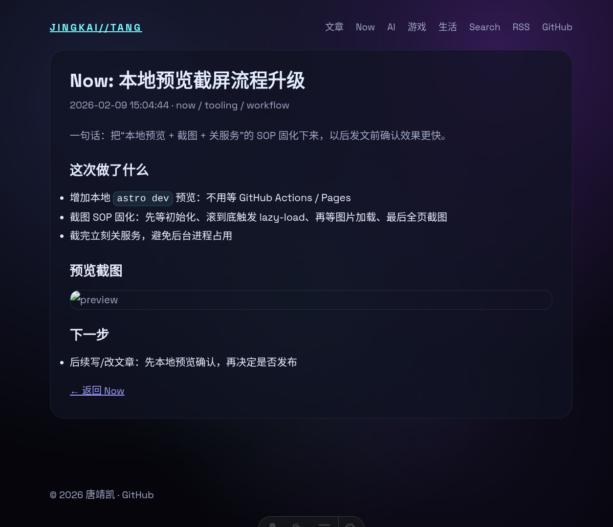

一句话：把“本地预览 + 截图 + 关服务”的 SOP 固化下来，以后发文前确认效果更快。

## 这次做了什么

- 增加本地 `astro dev` 预览：不用等 GitHub Actions / Pages
- 截图 SOP 固化：先等初始化、滚到底触发 lazy-load、再等图片加载、最后全页截图
- 截完立刻关服务，避免后台进程占用

## 预览截图

## 下一步

- 后续写/改文章：先本地预览确认，再决定是否发布
