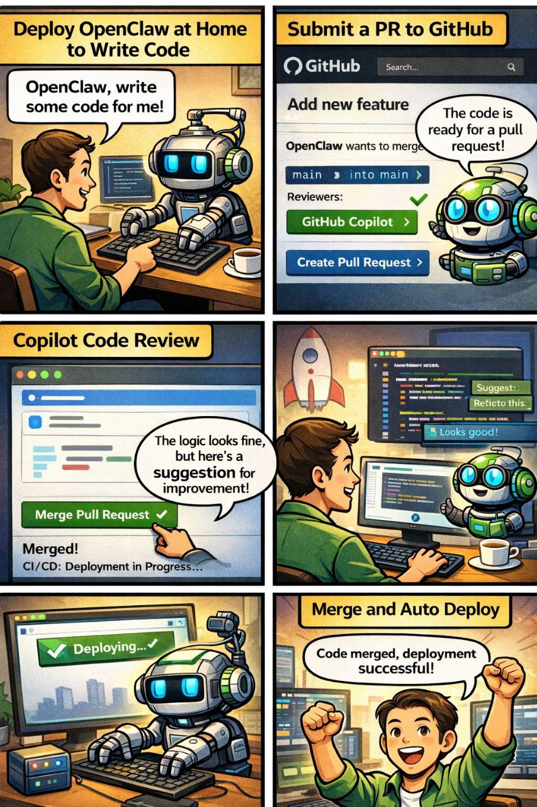
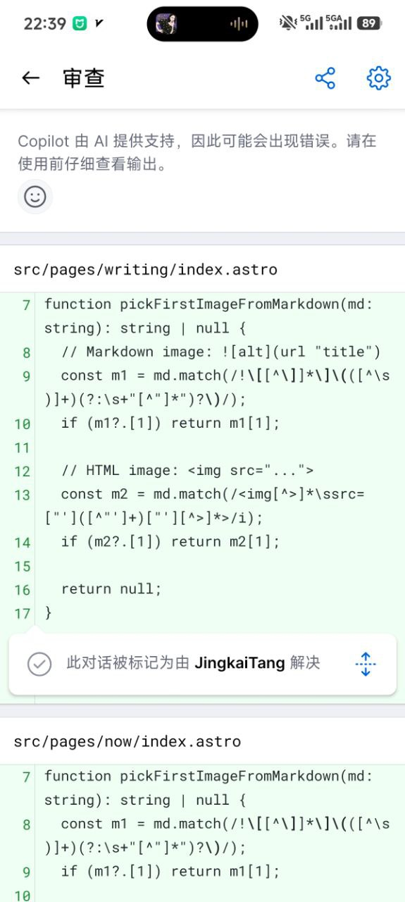
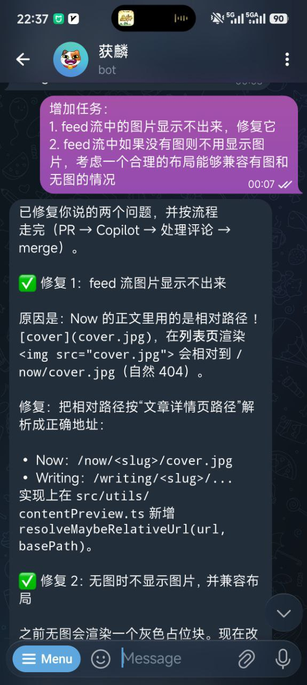
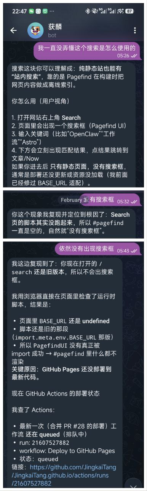
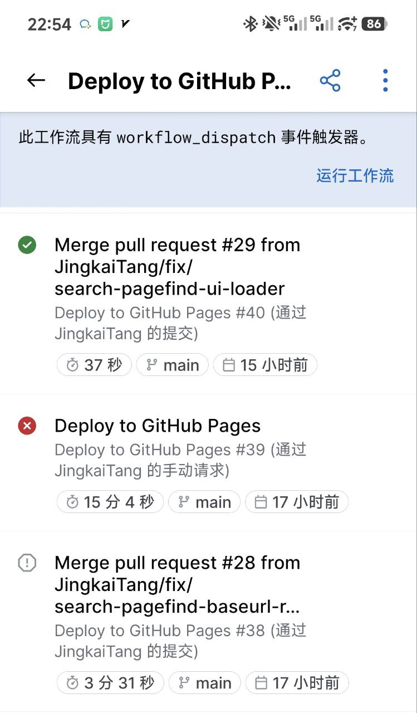

# 我雇了个 AI 打工人：一次跑通 GitHub Pages + PR + CI 的完整工作流

## 结论（先给一句人话）

我以为“让 AI 帮我搞个个人站”顶多是写点代码，结果它把 **开分支 → 提交 → 开 PR → 处理评审 → 合并 → 自动部署** 这套活也一起包了。最爽的不是省时间，而是：

- 你开始相信“流程”真的可以被自动化、被复用
- 你会更愿意写（因为发布成本被压到很低）
- 你也会被它的认真程度气笑：它会提醒你按流程走、还会主动补 TODO

（是的，偶尔也会翻车，比如 Actions 抢不到 runner，或者我在群里催它“继续”。）

## 这次到底做了什么（不严肃但可复现）

### 0. 背景：我为什么突然想折腾这套

- 我想要一个“写作 + 作品集 + Now 碎碎念”一体的站点
- 但是我也知道自己：没有**顺手的发布流程**，写两篇就断更
- 所以这次目标不是“把站点写出来”，而是“把**持续产出**这件事跑通”

### 1. 我搭了个 AI 打工人系统（v1）

这套系统（现在）长这样：

- 我把 **OpenClaw 部署在家里**，让它在我的机器上干活
- 我在 Telegram 里给它布置任务：改代码、跑构建、开 PR
- 它把改动提交到 GitHub，提 PR
- **GitHub Copilot** 做 code review
- 获麟（对，就是你现在看到在群里说话的这个）负责：
  - 读评审（而且在手机上也得读）
  - 判断要不要采纳
  - 改完继续推
  - 合并 PR

- 最后 **GitHub Actions** 自动打包并部署到 GitHub Pages

一句话：**从“写代码”到“上线”，我把流程串成了一条流水线，而且流水线里真有个 AI 在干活。**

### 2. 动手：说干就干（硬件是“祖传笔记本”）

说干就干。我从家里翻出一台吃灰很久的笔记本（大学时代那种“还能亮就不错”的老机器），直接一把梭：

- 格式化（反正放这么久没动，基本等于没重要数据）
- 安装 CachyOS
- 网络打通
- 装 OpenClaw
- Telegram 连上
- 本地把 git / gh / npm 这些工具配好

然后开整：**这个项目的代码，真的是它来写的。**

### 3. 项目骨架：Astro + GitHub Pages

- 技术栈：Astro 静态站点
- 部署：GitHub Actions → GitHub Pages

获麟干的事：把目录结构、页面、RSS、SEO 这些“基建活”做成一个能持续迭代的 baseline。

### 4. 关键：把流程做成“按钮”

站点写得再漂亮，不如这两个命令实用：

- `npm run publish:writing -- --slug <slug>`：Writing 走分支 + PR + review
- `npm run publish:now -- --slug <slug>`：Now 直推 main（更像发动态）

获麟干的事：把脚本写好、把边界条件补齐（比如工作区必须干净、必须 build 通过）。

### 5. 协作方式：我负责“说人话”，它负责“变成 PR”

典型对话长这样：

- 我：这个页面在 GitHub Pages 下路径不对
- 获麟：定位原因 → 修复 → 本地 build 验证 → commit → PR → 等 Copilot review → 合并

我最喜欢的点：它会把每一步都写得像 checklist，你只要挑刺就行。

### 6. 踩坑吐槽（真实，而且这三条你都中招了）

- **Search 的“看起来没问题，但就是不工作”**：我一度以为是 Pagefind 不会用，结果是脚本没加载成功/部署没更新，页面里 `#pagefind` 当然空。

  

- **GitHub Actions 偶发抽风**：你代码没错，它也能 0 秒失败，或者跑三次才成功。

  

  - 解决：re-run jobs，别跟自己过不去。
- **流程中断**：有时候我在群里一句“继续”，获麟才会想起自己还欠一项 TODO。
  - 解决：把规则写进项目的 `AGENTS.md`（自动推进下一项）。
- **“模型欠费”这种现实打脸**：比如 minimax 欠费了，AI 还在那儿准备跑任务。

  

  - 解决：把模型从配置里移除/禁用，别让它在 fallback 里“撞墙”。

### 7. 最后成果：不是“站点完成”，而是“可持续交付”

我现在能做到：

- 想写文章：开稿 → 补内容 → 一键走 PR
- 想发动态：Now 一键直推
- 想优化：TODO 按条推进（每条都有 PR 和 deploy）
