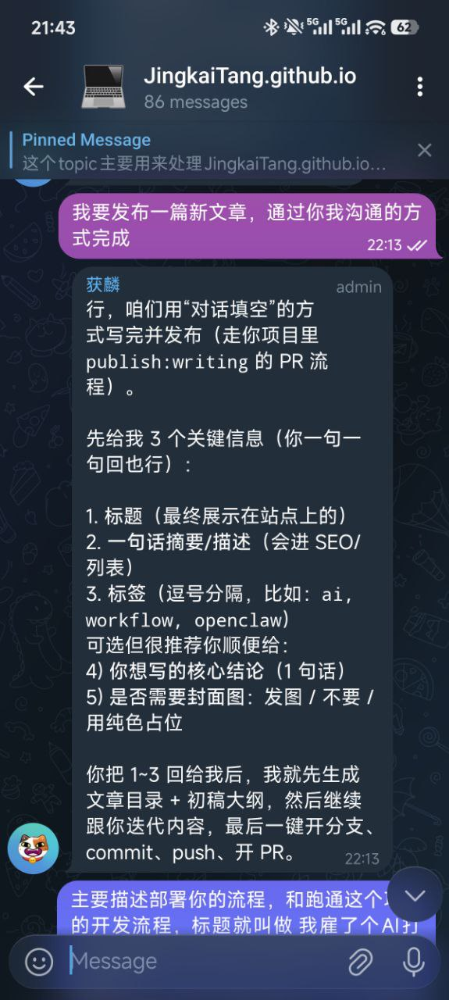
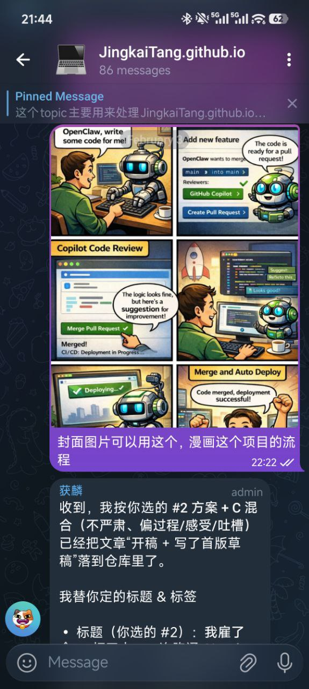
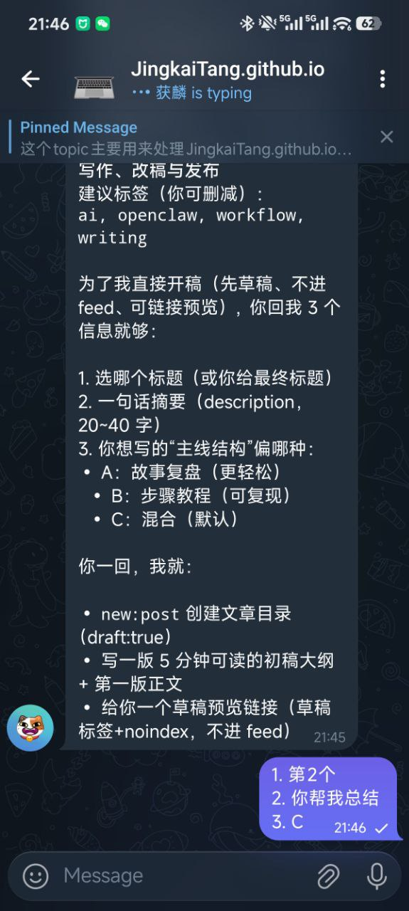

# 我用 Telegram 跟 AI 对话，把文章从草稿发到上线

## 一句话结论

把“写文章”变成一次对话，最大的变化不是省了多少时间，而是：**发布门槛被压到几乎为零，你会更愿意持续写下去**。

## 这套聊天式发布长什么样

核心思路：我只负责用人话描述需求（标题、语气、吐槽点、配图），获麟负责把它变成一个可上线的 commit。

大概流程是：

1. 我在 Telegram 里说：我要写一篇新文章
2. 获麟立刻反问 3 个关键字段：标题 / 摘要 / 标签（对话填空）
3. 我把过程碎碎念发过去（想到哪说到哪）
4. 获麟把碎碎念整理成文章结构（轻松、不端着，但能复现）
5. 我把截图丢过去
6. 获麟自动把截图放进文章目录，插到合适的位置，配图注
7. 草稿阶段：`draft:true`，不进 feed，但链接可访问（预览用）
8. 我确认发布：再把 `draft:false` 推上去（现在也支持一键确认发布）

## 三张截图，基本说明一切

### 1) “封面怎么选”也可以聊天解决

这里的关键不是“选封面”，而是：**所有资源都跟着文章目录走**，改稿、换图、补图都不会丢。

### 2) 对话填空：别让我写 PR，我只想写人话

你看这张图：我一句“通过你我沟通的方式完成”，获麟就能把它拆成可执行步骤：

- 先问清楚你要表达什么
- 先出一个能跑通的草稿
- 然后你补截图/补吐槽/补真实细节
- 最后再发布

## 为什么我喜欢这套（不严肃版）

- **写作成本低**：我不需要先想好结构，边聊边补就行
- **发布更像发动态**：尤其是 Now，简直就是“说一句→上线”
- **流程不会忘**：获麟比我记性好，甚至会提醒我“你还有个 TODO 没勾”
- **吐槽更自然**：聊天记录本身就是素材（比如 Actions 抽风、模型欠费这种）

### 3) 加图、改稿、甚至“写这篇文章本身”

你会发现它最像的不是“写作”，而是“提工单”：

- 你丢素材（段落/吐槽/截图）
- 它把素材变成可上线的内容
- 最后你只做一件事：确认发布

## 如果你也想抄：最小可行清单

- 一个能跑命令的 AI（比如 OpenClaw）
- 一个你天天用的聊天工具（比如 Telegram）
- 一个可重复的发布命令（draft / confirm publish）
- 一个原则：**AI 输出 commit，你输出人话**

---

PS：这篇文章本身，就是用这套流程写出来的。
